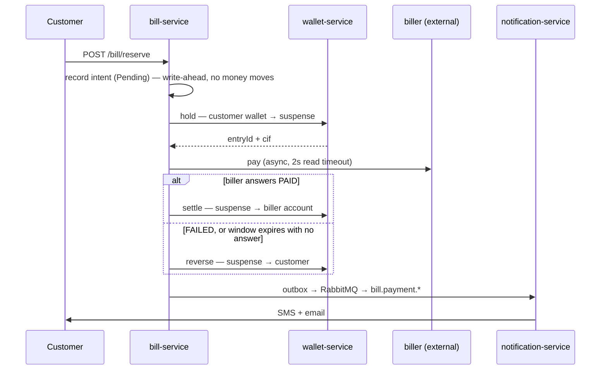

# QuickPay

A miniature SAR digital-wallet payment platform — built end to end, then deliberately broken
for six days to find out what it actually guarantees.

Three Spring Boot services, one broker, three databases, and a double-entry ledger whose
central rule is that **money is never created or destroyed**. The interesting part is not the
build; it is [Phase 7](docs/sabotage/PHASE7_REPORT.md), where that claim was attacked 14 times
with a written prediction committed before every run — and
[Phase 8](docs/load/PHASE8_REPORT.md), where it was run at ~1600 transfers per second and
still did not move.

---

## How this was built — who wrote what

This is a **learning project**, and it is built under a constraint that is enforced rather
than aspirational: **the human writes every line of application code. The AI assistant is
forbidden from writing any of it.**

The rules live in [`CLAUDE.md`](CLAUDE.md) and are read by the assistant at the start of every
session.

| | author |
|---|---|
| `wallet-service`, `bill-service`, `notification-service` — application code, SQL migrations, tests | **human, every line** |
| `scaffolding/**` — the gateway, biller and provider simulators | assistant |
| `docker-compose.yml`, `pom.xml`, `.github/workflows/` — build and test infrastructure, **only when explicitly asked** | assistant |
| `docs/**` — the sabotage records, the Phase 7 report, this README | assistant |

**The assistant's actual job is to be a blunt senior reviewer.** Asked about a bug, it explains
what is happening and why, then suggests the *shape* of a fix — pseudocode at most. It does not
hand over a patch. There is one deliberate escape hatch, invoked by name, under which it may
write real code — and then it must explain every line and tell the human to retype it rather
than paste it.

Two further rules shape what is in this repository:

- **A prediction must be written and committed before any experiment runs.** Every scenario in
  [`docs/sabotage/`](docs/sabotage/) opens with the human's prediction, verbatim, timestamped
  by its own commit — including the ones that turned out wrong. That is why the ~56% accuracy
  figure in the Phase 7 report means anything; it could not be adjusted afterwards.
- **Fixes must be earned.** A protection is added because a scenario measured the harm, not
  because it seemed prudent. This is why there is no circuit breaker in a codebase where five
  separate scenarios went looking for one.

The reasoning is simple: the learning value lives in writing the code, so an assistant that
writes it for you has removed the thing you were there for. Reviewing, arguing, and being
argued out of a position are all fair game — several decisions in the plan record the assistant
losing that argument.

---

## What it does

A customer pays a bill from their wallet. The money is held in a suspense account, sent to an
external biller, and either captured or refunded — and the customer is told which.



If the biller never answers, an **EOD reconciliation sweep** inquires until it does — bounded
by a **settlement window** that both sides now honour ([S09](docs/sabotage/S09-late-settlement.md),
[S11a](docs/sabotage/S11-biller-enforces-window.md)).

---

## Architecture

| component | port | database | role |
|---|---|---|---|
| `wallet-service` | 8080 | 5432 | the money core — ledger, balances, holds |
| `bill-service` | 8081 | 5433 | the saga — reserve → pay → capture/reverse |
| `notification-service` | 8082 | 5434 | SMS/email delivery with retry |
| RabbitMQ | 5672 / 15672 | — | `quickpay.events` topic exchange |
| `gateway-simulator` | 9090 | — | mock card gateway *(scaffolding)* |
| `biller-simulator` | 9091 | — | mock biller — fault injection *(scaffolding)* |
| `provider-simulator` | 9093 | — | mock SMS/email provider *(scaffolding)* |

**One database per service.** No service reads another's tables; they talk over HTTP and AMQP.

Events reach the broker through a **transactional outbox** — the event row is written in the
same transaction as the money movement, and a relay publishes it afterwards. Phase 7 showed
precisely what that does and does not guarantee ([S08](docs/sabotage/S08-broken-binding.md)).

---

## The money model

Every movement is a **double-entry ledger row**, enforced by database constraints rather than
by application code:

```sql
CHECK (debited_amount + credited_amount = 0)   -- the golden rule, per row
CHECK (credited_amount > 0)
CHECK (debited_wallet_number <> credited_wallet_number)
UNIQUE (idempotency_key)                       -- one request == one movement
UNIQUE (coalesce(reverses_entry_id, settles_entry_id))   -- a hold is discharged once
CHECK  (reverses_entry_id IS NULL OR settles_entry_id IS NULL)
```

Customer money never vanishes into a variable — it moves between **internal accounts** that
are themselves wallets, so every balance is reconstructable from the ledger alone:

| wallet | purpose |
|---|---|
| `000000000001` | Internal TopUp — where deposits originate |
| `000000000002` | Outward Transfer — where withdrawals go |
| `000000000003` | Suspense — holds live here between reserve and settle |
| `000000000004` | Bill Account — the biller's settlement account |

Two independent checks are run after every sabotage scenario: the held-money identity
(`SUM(HOLD) − SUM(SETTLEMENT) − SUM(RELEASE)`) and the suspense account's own balance.
[S09](docs/sabotage/S09-late-settlement.md) explains why *two counts that share a source are
one count* — the most useful thing the project has learned.

---

## Running it

**Requires** JDK 21 and Docker.

```bash
docker compose up -d          # 3 × postgres + rabbitmq
mvn -B verify                 # build + Testcontainers integration tests

# then run each service (IDE or jar)
java -jar wallet-service/target/wallet-service-0.0.1-SNAPSHOT.jar
java -jar bill-service/target/bill-service-0.0.1-SNAPSHOT.jar
java -jar notification-service/target/notification-service-0.0.1-SNAPSHOT.jar
java -jar scaffolding/biller-simulator/target/biller-simulator-0.0.1-SNAPSHOT.jar
java -jar scaffolding/provider-simulator/target/provider-simulator-0.0.1-SNAPSHOT.jar
```

Pay a bill:

```bash
curl -X POST localhost:8081/bill/reserve \
  -H 'Content-Type: application/json' \
  -H 'Idempotency-Key: demo-001' \
  -d '{"billReference":"ELEC-001","walletNumber":"015100000001","amount":77}'
```

The simulators expose a control panel for deterministic fault injection:

```bash
curl -X POST localhost:9091/simulate/mode \
  -H 'Content-Type: application/json' \
  -d '{"outcome":"TIMEOUT","delayMs":0,"timeoutSleepMs":90000}'
```

`SUCCESS · FAIL · SERVER_ERROR · TIMEOUT · NORMAL` — this is how every Phase 7 scenario was run.

---

## Phase 7 — sabotage

**[Read the full report →](docs/sabotage/PHASE7_REPORT.md)**

14 documented runs. Every prediction written and committed *before* its run; **~56% were
right**, and the misses taught more than the hits. Five runs falsified a premise the run
itself was built on.

**The golden rule held in all 14 runs — and the most valuable finding is that this was never
as reassuring as it looked:**

- **[S09](docs/sabotage/S09-late-settlement.md)** — the golden rule held *while money was
  lost*. Both counts derive from the wallet's own ledger, so neither can see a debt to the
  biller.
- **[S10](docs/sabotage/S10-consumer-side-loss.md)** — the invariants protect money; nothing
  protects the customer's knowledge. Also: `5 retries × 5 s` = **25 seconds** before a
  notification is destroyed permanently.
- **[S12](docs/sabotage/S12-duplicate.md)** — under concurrency every code-level check caught
  **0 of 10**, while the database constraints caught **9 of 9**.

**Four fixes were built.** A circuit breaker was **not** — across five scenarios. S02b earned
it; [S03](docs/sabotage/S03-bulk-inquiry.md) then withdrew the verdict by deleting 80% of the
cost with batching. *Before adding a mechanism to manage a cost, ask whether the cost can be
removed.*

---

## Phase 8 — load test

**[Read the full report →](docs/load/PHASE8_REPORT.md)**

P2P sustains **~1560 req/s** against a 500 TPS requirement — **3.1× over** — with **zero
errors, zero drift and zero duplicate idempotency keys across ~929,000 transfers**.

**The bottleneck moved three times**, each time one was relieved:

```
2 CPU           both tiers pinned at ~107% of budget       1560/s
4 CPU           neither pinned; the POOL at 9 of 10        1716/s
4 CPU pool 50   the DATABASE at 98%, the app at 58%        1867/s
```

⚠️ **The most useful result is negative.** Raising the connection pool 10 → 50 at the shipped
configuration made throughput **11% worse** and drove lock waits from 1 to 26 — the *identical*
change bought +8.8% later, once CPU was relieved. **Right fix, wrong constraint.** A diagnosis
that stopped at "pool exhausted, raise the pool" would have shipped a regression with a
plausible story attached.

**`application.yml` is unchanged, deliberately** — a system 3.1× over its target does not need
tuning. The tuning above is diagnostic. Same earned-fixes rule that kept the circuit breaker
out of Phase 7.

---

## Documentation

| file | what it is |
|---|---|
| [`PROJECT_PLAN.md`](PROJECT_PLAN.md) | the living plan — current state, decisions, ordered backlog, `NEXT ACTION` |
| [`docs/sabotage/`](docs/sabotage/) | one record per scenario: prediction, result, what was fixed and what was not |
| [`docs/sabotage/PHASE7_REPORT.md`](docs/sabotage/PHASE7_REPORT.md) | the synthesis — start here |
| [`docs/load/PHASE8_REPORT.md`](docs/load/PHASE8_REPORT.md) | the load test — breaking TPS, the bottleneck, and the fix that moved it |
| [`adr/`](adr/) | architecture decision records — two-leg ledger, system accounts, immutable migrations, RabbitMQ fan-out |
| [`docs/diagrams/`](docs/diagrams/) | flow diagrams — bill payment, gateway webhook, notification |
| [`learning-playbook.md`](learning-playbook.md) · [`learning-log.md`](learning-log.md) | the method, and the per-session log |
| [`CLAUDE.md`](CLAUDE.md) | rules for AI agents working in this repo |

---

## Scope

Deliberately bounded, and the bounds are enforced: **max 4 services**, one database per
service, RabbitMQ for events, Docker Compose only — no Kubernetes, no Spring Cloud, no
gold-plating. The external gateway, biller and SMS/email provider are mocks under
`scaffolding/`.

**Service #4 is a customer service** (decided 10 Sep). Transaction history was dropped from
this project and parked to a separate Kafka project — it needs the event stream that project
exists to build. An event-fed archive/warehouse was proposed and **parked to the same place**:
the instinct is right, but it breaks the RabbitMQ-only constraint, and the thing actually
needed today is two SQL queries, not a warehouse.

Everything under `scaffolding/` is test infrastructure, not product — the three simulators and
the Phase 8 load harness.

**Status:** two of the three [definition-of-done](PROJECT_PLAN.md) gates are closed. The
sabotage log and the load report are signed off; the remaining gate is **auth**, which is in
progress. QuickPay is not done.