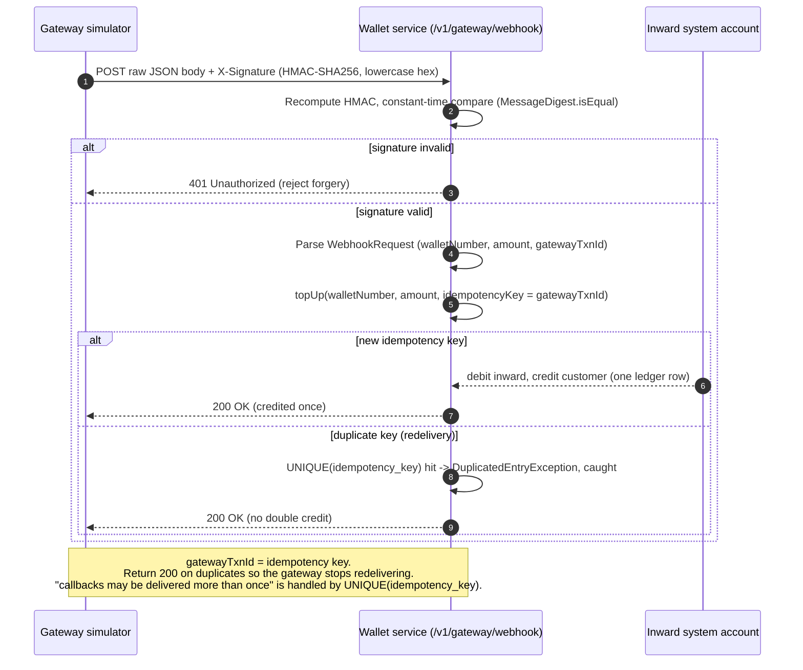

# Gateway webhook flow (top-up via external payment gateway)

Built & verified 2026-06-16/17 (PR#2). The gateway simulator (`scaffolding/gateway-simulator`,
:9090) sends an HMAC-signed webhook to the wallet service (`POST /v1/gateway/webhook`, :8080),
which credits the customer exactly once even if the callback is redelivered.

**Key guarantees**
- **Authenticity:** HMAC-SHA256 over the raw body, constant-time compare → forged calls get 401.
- **Exactly-once credit:** `gatewayTxnId` is the idempotency key; `UNIQUE(idempotency_key)` on the
  ledger makes redelivery a no-op.
- **Stop the retries:** duplicates return **200** (not an error) so the gateway stops redelivering.