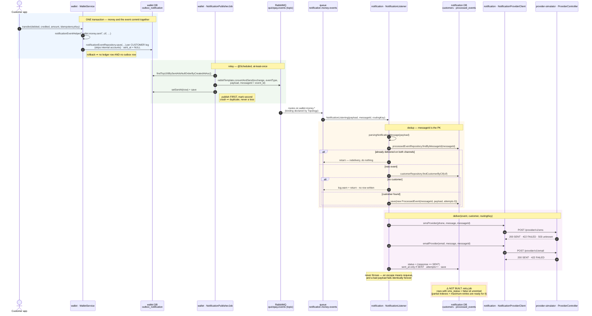

# Notification flow (outbox → broker → consumer → provider)

Built 2026-08-03 → 08-09, verified end to end. Notifications is **service #3** (ADR-0005:
RabbitMQ for domain-event fan-out). The wallet publishes *facts*; notifications decides
what deserves an SMS. Class and method names below are the real ones in the code.



## Why each piece is there

**The outbox write is inside the money transaction.** Committing the ledger row and then
publishing would lose the event if the process died in between — the failure handler never
runs, so nothing records that a notification was owed. Writing the row in the *same*
transaction makes the guarantee structural: **if the money moved, the obligation exists.**
Same write-ahead shape as the bill record.

**The relay publishes first and marks `sent_at` second.** Reversing them trades an
occasional duplicate for an occasional permanent loss. Duplicates are recoverable;
missing events are not.

**One identifier carries idempotency through four hops:**

```
outbox_notification.event_id  →  AMQP message_id  →  processed_events.message_id (PK)  →  provider reference
```

Because it is the *primary key* of `processed_events`, a duplicate is not merely detected —
it is impossible to insert twice.

**The consumer declares its own queue and binding** (`Topology`). The wallet declares only
the exchange. Adding history later means declaring another queue with another binding;
no publisher changes.

**The listener never throws.** An exception escaping a `@RabbitListener` tells RabbitMQ to
requeue — and a malformed payload or an unknown `cif` fails identically on every
redelivery, so it becomes a hot loop. Both are logged and dropped instead.

**Unknown `cif` writes no row.** Customers are seeded, so "unknown" means *never notify*.
A row would be permanent retry fodder — there is no "undeliverable" state, only
`false` = "retry me".

**`sent_at` is stamped only on success.** `last_attempt_at` records that we *tried*;
`sms_sent_at` records that it *went out*. A null `sent_at` therefore means "never
delivered" unambiguously — which is what the retry job will act on. (This was a real bug,
found by reading the data: statuses said `false` while timestamps claimed a delivery.)

## Verified

- Full chain, first run: 3 outbox rows → queue drained (`consumers: 1`) → 3 rows in
  `processed_events` → provider recorded the sends.
- Forced `FAILED`: statuses false, both `sent_at` null, `last_attempt_at` set.
- Forced `SENT`: statuses true, both `sent_at` set.
- Atomicity (wallet side): a transfer failing on insufficient balance writes **neither** a
  ledger row nor an outbox row.

## Open

- **The retry job does not exist.** Rows with `sms_status = false` are never retried. The
  partial indexes (`(created_at) WHERE sms_status = false`, likewise for email),
  `attempts`, `last_attempt_at` and `maximum-retries` are all in place for it. It will be
  the **third caller** of `deliver(...)`, after the new-event and redelivery paths.
- **The bill service publishes nothing yet** — no `BillPaid` / `BillRejected`, so
  notifications only sees wallet events.
- **A bill reserve also emits a wallet event**, so a bill payment will produce a wallet
  notification *and* a bill one. Suppression is a notifications-side policy call: the
  wallet publishes facts, and history needs all of them.